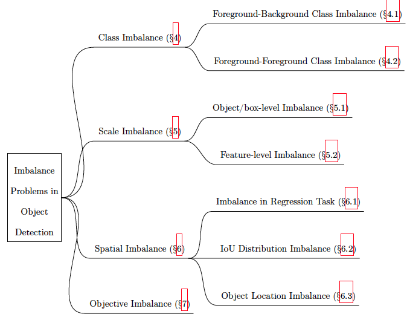

# Imbalance Problems in Object Detection: A Review

Here, we present the list of papers within the scope of imbalance problems in object detection by following our problem-based taxonomy in our paper submitted to IJCV. You can find a preprint in the following link:

The taxonomy that we consider is as follows. The numbers in the parenthesis indicates the section that the corresponding problem is discussed in the paper.

# Class Imbalance

## Foreground-Backgorund Class Imbalance
- Hard Sampling Methods
   - Random Sampling  
   - Hard Example Mining  
     - Bootstrapping, NeurIPS, <https://papers.nips.cc/paper/1168-human-face-detection-in-visual-scenes.pdf> 
     - SSD, ECCV 2016, <http://www.cs.unc.edu/~wliu/papers/ssd.pdf>
     - Online Hard Example Mining
     - IoU-based Sampling
   - Limit Search Space  
     - Two-stage Object Detectors 
     - IoU-lower Bound
     - Objectness Prior  
     - Negative Anchor Filtering
- Soft Sampling Methods  
   - Focal Loss 
   - Gradient Harmonizing Mechanism  
   - Prime Sample Attention  
   - AP Loss  
   - DR Loss  
- Generative Methods  
   - Adversarial Faster-RCNN 
   - Task Aware Data Synthesis
   - PSIS
   - Bounding Box Generator 

## Foreground-Foreground Class Imbalance  
   - Fine-tuning Long Tail Distribution for Obj.Det.
   - PSIS  
   - OFB Sampling

# Scale Imbalance

## Object/box-level Scale Imbalance

- Methods Predicting from the Feature Hierarchy of Backbone Features
  - Scale-dependent Pooling
  - SSD
  - Multi Scale CNN
  - Scale Aware Fast R-CNN

- Methods Based on Feature Pyramids
  - FPN
  - See feature-level imbalance methods

- Methods Based on Image Pyramids
  - SNIP
  - SNIPER

- Methods Combining Image and Feature Pyramids
  - Scale Aware Trident Network

## Feature-level Imbalance
- Methods Using Pyramidal Features as a Basis
  - PANet
  - Libra FPN

- Methods Using Backbone Features as a Basis
  - STDN
  - Parallel-FPN
  - Deep Feature Pyramid Reconf.
  - Zoom Out-and-In
  - Multi-level FPN
  - NAS-FPN
  - Det-NAS

# Spatial Imbalance

## Imbalance in Regression Loss
- Lp norm based
  - Smooth L1
  - Balanced L1
  - KL Loss
  - Gradient Harmonizing Mechanism

- IoU based
  - IoU Loss
  - Bounded IoU Loss
  - GIoU Loss
       
## IoU Distribution Imbalance
- Cascade R-CNN

## Object Location Imbalance
- Guided Anchoring

# Objective Imbalance
- Task Weighting
- Classification Aware Regression Loss
		
